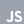

# Who Am I
I’m **Mohammed Anasuddin**, a Full Stack Developer who enjoys turning ideas into fast, usable, and thoughtfully designed systems.
I value clarity, clean logic, and building things that actually make someone’s day easier.

```js
import Engineer from "./profile.js";
let mohammed_anasuddin = new Engineer({
  branch: "CSE",
  cgpa: 8.38,
  college: "St. Peter's Engineering College (Hyderabad)",
  responsiblities: [
    "Former President@CSE-Club",
    "Former Advisor@Origin(CSE-IT Club)"
  ]
});
```


# How I Build

I like understanding problems deeply and _planning the flow before I write a single line of code_.
My approach is simple: understand what’s needed, map out how it should work, build it cleanly, and refine it until the system feels smooth and reliable.

```js
mohammed_anasuddin.setCore({
  role: "SDE-Full Stack Developer",
  stack: "JavaScript Ecosystem",
  focus: "Real-World systems",
  philosophy: "understand → design → build → refine",
});
```


# How I Learn

I learn by exploring internals, reading documentation directly, and experimenting until I fully understand something.

```js
mohammed_anasuddin.enableLearning({
  approach: "understand internals, read docs, experiment",
  belief: "Understanding builds confidence",
});
```

This block outlines my learning behaviour, fueled by curiosity and iteration.

---

# Project Spotlight — LookJobs

**LookJobs** reduces job-search fatigue by centralizing job postings using automation and scheduled scraping.

```js
mohammed_anasuddin.addProject("LookJobs", {
  problem: "Job search fatigue and scattered job platforms",
  solution: "Automate job discovery and centralize listings",
  type: "Automation & scraping system",
  idea: "Scheduled web scraping + unified job feed",
  stack: ["Puppeteer", "PostgreSQL", "Cron", "React"],
});
```

---

# Project Spotlight — TwistyXO

A strategic take on tic-tac-toe by introducing expiring moves, forcing adaptive decision-making.

```js
mohammed_anasuddin.addProject("TwistyXO", {
  problem: "Classic tic-tac-toe becomes predictable quickly",
  solution: "Introduce expiring moves to create adaptive strategy",
  type: "Strategy game engine",
  idea: "Expiring moves → adaptive play",
  stack: ["React", "Context API"],
});
```

---

# Project Spotlight — CampusBuzz

A real-time campus events system that keeps students updated about activities, events, and announcements.

```js
mohammed_anasuddin.addProject("CampusBuzz", {
  problem: "Campus events are scattered and hard to track in real-time",
  solution: "Centralized live event feed with engagement tools",
  type: "Realtime feed + auth + dashboards",
  stack: ["Flutter", "Firebase"],
});
```


# What I Work With

## Programming Languages


<div align="center">


| HTML | CSS | JavaScript | TypeScript |
|:----:|:---:|:----------:|:-----------:|
|  |  |  |  |


| SQL | Java | Python |  
|:---:|:----:|:-------:|
|  |  |  |  


</div>


## Development

### Frontend
<div align="center">

| ReactJS                                         | React Router                                        | Redux                                         | TailwindCSS                                         |
|:---------------------------------------------:|:---------------------------------------------------:|:---------------------------------------------:|:---------------------------------------------------:|
|  |  |  |  |

| Daisy UI                                        | Responsive CSS                                     |
|:-----------------------------------------------:|:--------------------------------------------------:|
|  |  |

</div>


### API & Integration

<div align="center">

| REST APIs                                       | Axios                                         | TanStack Router (React Query)                      |
|:-----------------------------------------------:|:---------------------------------------------:|:--------------------------------------------------:|
|  |  |  |


</div>


### Backend

<div align="center">

| NodeJS                                         | ExpressJS                                         | MongoDB                                         | PostgreSQL                                         |
|:----------------------------------------------:|:-------------------------------------------------:|:-----------------------------------------------:|:--------------------------------------------------:|
|  |  |  |  |

</div>

<div align="center">

| Firebase Database                       | Firebase Auth                                      | Oauth                                         | JWT                                         |
|:------------------------------------------------:|:--------------------------------------------------:|:---------------------------------------------:|:-------------------------------------------:|
|  |  |  |  |

</div>

### Version Control

<div align="center">


| Git                           | GitHub                          | Git Lens                                        |
|:-----------------------------:|:-------------------------------:|:-----------------------------------------------:|
|  |  |  |

</div>


### Testing

<div align="center">

| Jest                           |
|:------------------------------:|
|  |

</div>


### Practices

<div align="center">

| Debugging                      | Clean Code                         | Optimization                          |
|:------------------------------:|:----------------------------------:|:-------------------------------------:|
|  |  |  |

</div>


---

# What I Aim For

```js
mohammed_anasuddin.setRoadmap([
  "Advanced system architecture",
  "Automation pipelines & intelligent flows",
  "Scalable production systems",
  "Integrating AI into Systems",
]);
```

This is my learning and development trajectory for the coming years.

---

# Export — Final Build

```js
export default mohammed_anasuddin
```

```bash
> engineer.profile build completed
```
